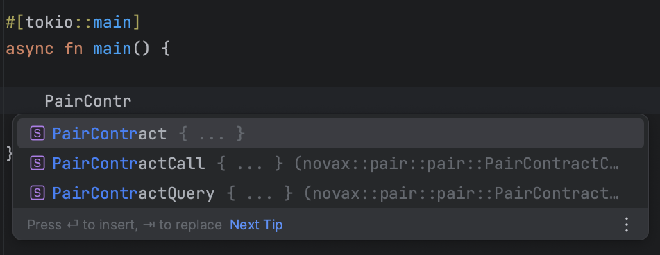
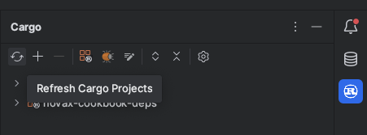

## Validating NovaX Setup

### Verifying Struct Generation

To ensure NovaX has been configured correctly, the most straightforward method is to put it to the test.

Suppose you've placed the `pair.abi.json` from xExchange inside the `.novax/abis` directory. On executing the `cargo build` command, NovaX will generate a `PairContract` struct that corresponds to the xExchange's pair contract.

Here's a simple validation procedure:

1. In any Rust file, like `lib.rs`, `main.rs`, etc., add the following code snippet:

```rust,ignore
# extern crate novax;
use novax::pair::pair::PairContract;

async fn hello() { 
   let _pair_contract = PairContract::new("");
}
```

2. Now, try to compile the code.

If the code compiles without any errors, congratulations! It signifies that NovaX has been successfully set up in your project.

> **Note:** Do not attempt to run the code, as it will lead to an error. The purpose of this snippet is solely to check its compilation.

### Testing Autocompletion

Autocompletion is a handy feature that boosts your productivity by suggesting relevant code snippets as you type. Let's ensure this is working for the generated structures.

1. **Autocompletion Test:** After the successful setup in the previous step, along with the `PairContract`, a `PairContractQuery` struct should also be generated. Start typing `PairContr` in your Rust file. Your IDE should offer autocompletion, suggesting the `PairContractQuery`:

   


If you witness the autocompletion in action, then everything's set! You can proceed to the next chapter.

However, if the autocompletion is missing:

1. **Clear Cargo Cache:** Execute `cargo clean` in your terminal to remove the cached files.
2. **Rebuild Project:** Run `cargo build` to rebuild the project.
3. **Re-index your project:** This step often fixes autocompletion issues. While it isn't always necessary in VSCode, it's sometimes required in JetBrains IDEs like IntelliJ or CLion. Open the cargo panel on the right and click on the refresh button.

   
